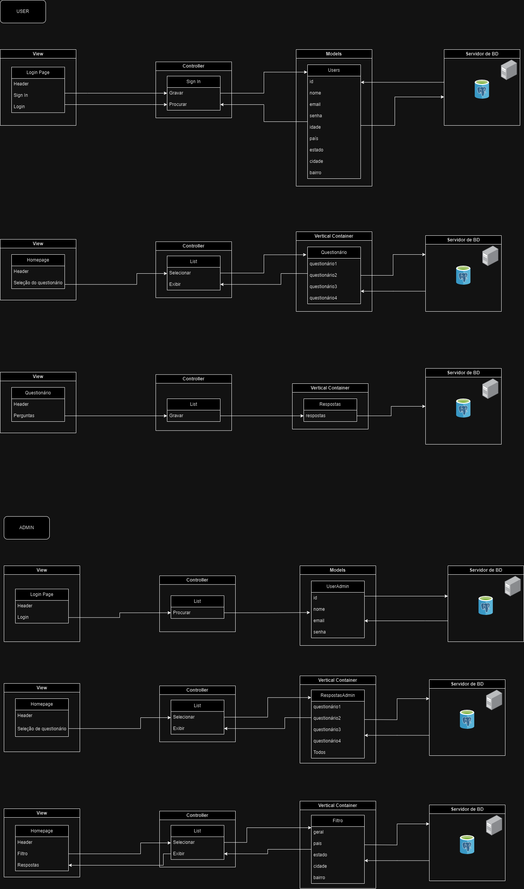

# 1. Informações do Projeto
## 1.1. Nome
Abandono Zero

## 1.2. Descrição
&nbsp;&nbsp;&nbsp;&nbsp;&nbsp;&nbsp;O projeto "Abandono Zero", desenvolvido pelo grupo Datadogs em parceria com o Instituto Nacional de Psicologia e Saúde Animal (INSPA), concentra-se no desenvolvimento de uma plataforma web. Esta plataforma visa coletar informações cruciais sobre os motivos que levam à adoção, compra e ao abandono de animais, bem como detalhes sobre o ambiente em que esses animais vivem.

## 1.3. Arquitetura
<a href="https://drive.google.com/file/d/1SEJPzJZil3Yw_3gvtmUR4argtEx2WM9o/view?usp=sharing">MVC (Model-View-Controller)</a>

## 1.4. Ferramenta de Diagramação
<a href="https://drive.google.com/file/d/1SEJPzJZil3Yw_3gvtmUR4argtEx2WM9o/view?usp=sharing">draw.io</a>   

# 2. MVC

Figura 1 - Imagem Modelo MVC

Fonte: Material produzido pelos autores (2024)

# 3. Modelos (Models):
Responsável por representar os dados do sistema e a lógica de negócios.   
**Users** - Recebe as informações do usuário e as envia para o banco de dados  
**Questionário** - Seleciona o formulário escolhido pelo usuário  
**Respostas** - Recebe as respostas do usuário  
**UserAdmin** - Recebe as informações do admin e as envia para o banco de dados  
**RespostasAdmin** - Resgata as respostas dos usuários  
**Filtros** - Filtra as respostas por região (país, estado, cidade, bairro)  

# 4. Controladores (Controllers)
O Controlador atua como um intermediário entre o Modelo e a Visão, recebendo as solicitações do usuário, interage com o Modelo para obter os dados necessários e os envia para a Visão para exibição.   
**Gravar** - Grava os dados no Banco de Dados  
**Procurar** - Procura os dados inseridos no Banco de Dados  
**Selecionar** - Seleciona algum tópico que será exibido do View  
**Exibir** - Exibi a informação ao usuário  

 
# 5. Views (Views)
A Visão é responsável pela apresentação dos dados ao usuário.

## 5.1. Users
**Header** - Cabeçalho do site  
**Sign In** - Espaço destinado para criar uma conta no site 
**Login** - Espaço destinado para o usuário acessar a sua conta 
**Seleção de questionário** - Espaço para o usuário selecionar qual dos 4 questionários disponíveis se encaixa na realidade dele para responder 
**Perguntas** - Espaço onde aparecem as perguntas do questionário e o espaço para que o usuário as responda 

## 5.2. Admin
**Header** - Cabeçalho do site 
**Login** - Espaço destinado para o admin acessar a sua conta 
**Seleção de questionário** - Espaço destinado para o admin selecionar qual dos questionário ele deseja ver as respostas 
**Filtro** - Local onde o admin consegue filtrar as respostas do questionário selecionado por região (país, estado, cidade, bairro) 
**Respostas** - Local onde as respostas são exibidas para o admin de acordo com os filtros selecionados 

# 6. Infraestrutura 
## 6.1. Banco de Dados
O banco de dados desempenha um papel fundamental no projeto "Abandono Zero", impactando-o de várias maneiras:  
 
**Armazenamento de Dados** - O banco de dados é o local onde todas as informações coletadas através do formulário da plataforma são armazenadas. Isso inclui dados sobre os motivos de adoção, compra e abandono de animais, bem como detalhes sobre o ambiente em que esses animais estão inseridos. A escolha de um banco de dados relacional oferece uma estrutura organizada para armazenar e gerenciar esses dados de forma eficiente.  
**Consistência e Integridade** -  Um banco de dados relacional garante a precisão, completude e integridade dos dados, fornecendo uma base confiável para análises e conclusões.  
**Recuperação de Dados** - Facilita a recuperação dos dados para análises posteriores, essencial para entender tendências e desenvolver estratégias eficazes.  
**Segurança dos Dados** - Implementa medidas de segurança para proteger os dados contra acesso não autorizado e garantir conformidade com regulamentações de privacidade.  
 
&nbsp;&nbsp;&nbsp;&nbsp;&nbsp;&nbsp;Em resumo, o banco de dados desempenha um papel de extrema importância no projeto "Abandono Zero", impactando o armazenamento, a integridade e a segurança dpos dados.

### 6.2.1. Integração com o MVC
A relação do banco de dados com a arquitetura Modelo-Visão-Controlador (MVC) é fundamental para o funcionamento e a estruturação do sistema.
#### 5.2.1.1. Model
É a camada que interage diretamente com o banco de dados para realizar operações como consultas, inserções, atualizações e exclusões, mapeando os objetos de domínio da aplicação para as tabelas do banco de dados e vice-versa, garantindo a consistência e a integridade dos dados.

#### 6.2.1.2. Controller
Em relação ao banco de dados, o Controlador pode iniciar operações de leitura ou escrita no Modelo com base nas ações do usuário, como submissão de formulários ou cliques em botões.

#### 6.2.1.3. View
Não interage diretamente com o banco de dados, pois seu papel é apenas exibir os dados fornecidos pelo Modelo de uma maneira que seja compreensível para o usuário mas pode fazer solicitações ao Controlador para obter dados específicos a serem exibidos.

# 7. Recursos Adicionais:  
Documentação do Sails.js: https://github.com/balderdashy/sails   
Tutorial do draw.io: https://m.youtube.com/watch?v=w3zm-wbmlpc   
Exemplos de diagramas MVC: https://www.lucidchart.com/pages/templates
